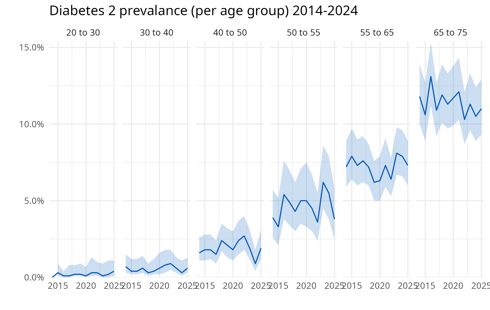
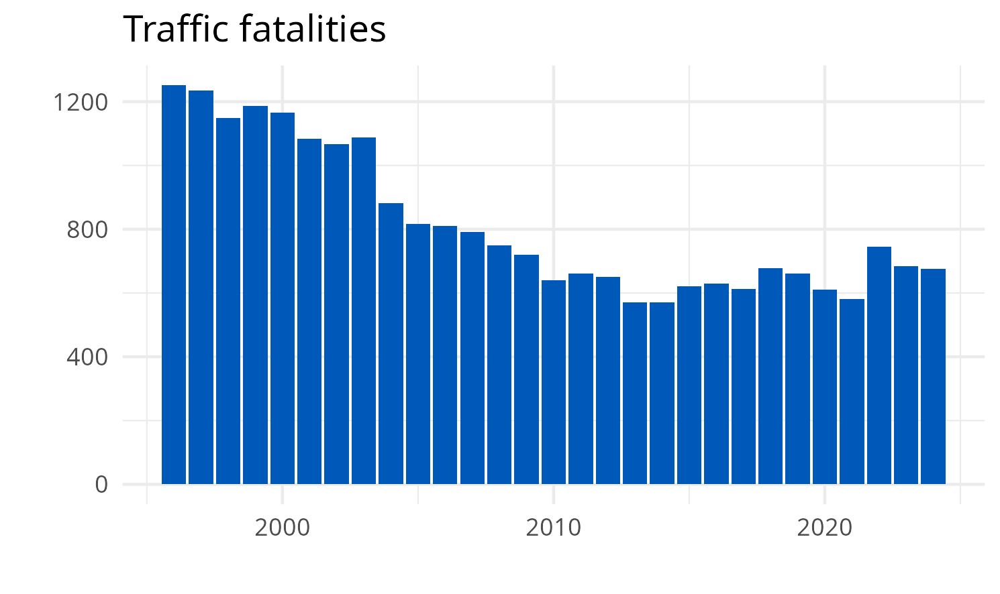
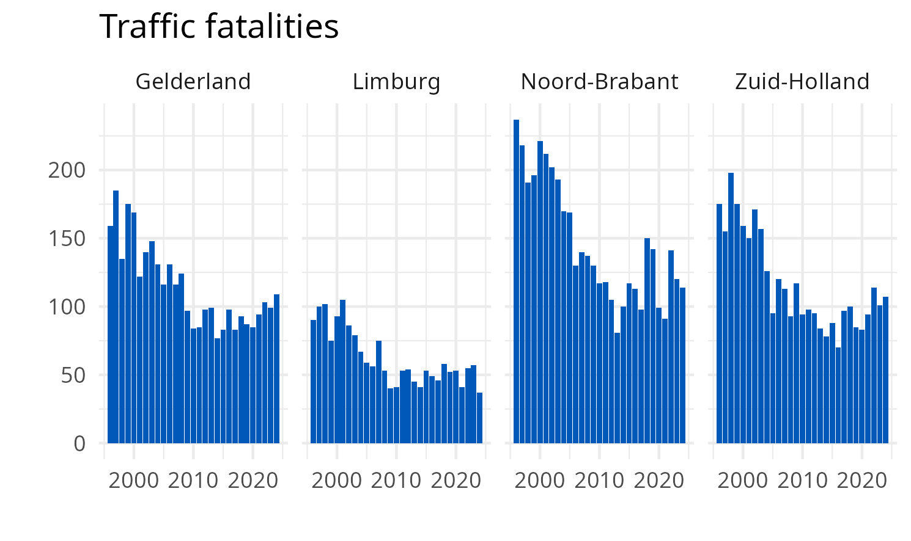

## Opgave 1

Reproduceer de volgende visualisatie:

Probeer alle aspecten te reproduceren (titel, assen etc.)

- Download de benodigde data uit StatLine et behulp van cbsodataR: 
diabetes naar leeftijd met marges. (tabel id = "85454NED")
- De plot gebruikt `geom_ribbon` en facets.

## Opgave 2

Zoek de data over verkeersdoden in StatLine en

a) Reproduceer de volgende visualsatie:

b) En deze:

